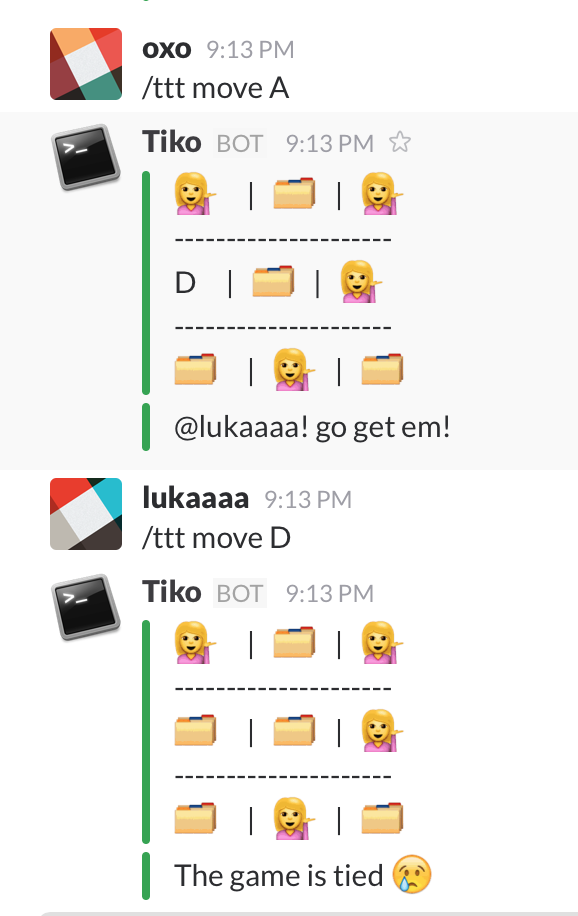

# Slack Tic Tac Toe

Slack tic tac toe service that allows you to play tic tac toe with with
someone in any slack channel



# Rules

If your unfamiliar with the complex rules of tic tac toe, fret not! this wikipedia
article will save your day!

There are a couple other rules when playing Tic Tac Toe in slack

- There can only be 1 game happening at a channel at one time
- Only the members that started the game and end a game
- You MUST play with emojies 😎

# Commands

`/ttt challenge [@username] [:emoji:]` To challenge a member to a game. Instead of an X, their symbol would be an emoji.
`/ttt accept [:emoji:]` To accept a challenge and start a game. Instead of an O, their symbol would be an emoji.
`/ttt move [Cell Name]` Place player emoji on a cell.
`/ttt quit` Quit the current game on the channel (Either players can quit).
`/ttt status` See the Status of the current board and who's turn in is.
`/ttt help` See what commands are available.

# Architecture

### Board
The Architecture for this service is a simple. first we have generic board, player
and cell classes that handle maintaining the game board and checking for winners


## Game Engine
Then we have the game_engine `tic_tac_toe`, this class will validate moves, swap players,
print the board and map moves.

### Commands
Once we have a working game_engine and a board, the only thing left is to build and API
that allows us to operate the game. Now, in the case of Slack slash commands, this comes in
the form of a command Architecture. Based on the `text` param and the JSON post, we can parse
it and determine which command to run.

Messaging the Slack channel all comes in the form of responses. The only time this services
messages the slack room is due to a response of the POST request.

### Game Tracker
GameTracker is composed of two global object and a module that maintains them. every active game
sits in the global `allActiveTicTacToeGames`, which is hash where the key is `channel_id` and value
is the `game` object. If the game object no longer lives in memory then the game
doesn't exist any where.

> `allActiveTicTacToeGames` is an object that live in memory, that means should the heroku box running
the service where, be terminated, all the games are also lost. Furthermore since this service is
deployed on the free tier of Heroku, after a short period of time the Dynos are scaled down to 0 meaning
the service is reset. This also means that if a game is abandoned in the middle, the Dyno box will naturally
clear out the game state. I call this a feature not a bug :P

GameTracker also handles the broadcasting and accepting of challenges. The process to start a game is
- broadcast a challenge against a user on a channel
- the user has to accept

However, multiple people can broadcast multiple challenges on the same channel. If any one of the challenges
gets accepted, all other challenges on that channel get cleared. If the same person is challenged by 2 or more
people, when that user accepts, the first challenge is accepted.

# Installation

- clone the repo
```sh
git clone git@github.com:sh6khan/slack-tic-tac-toe.git
cd slack-tic-tac-toe
```
- Install the packages locally
```sh
npm install
```
- run the tests
```sh
npm test
```
All the tests are properly mocked, meaning that you wont need internet connection
to run them

# Deployed on Heroku

Check out [getting started with heroku](https://devcenter.heroku.com/articles/getting-started-with-nodejs#introduction)
to see how this service is deployed.

> This service is deployed on the free tier of Heroku and therefore service is atomically scaled down.
This means the first command usually times out because Heroku is busy scaling it back up. 2nd requests
and going forward work fine
